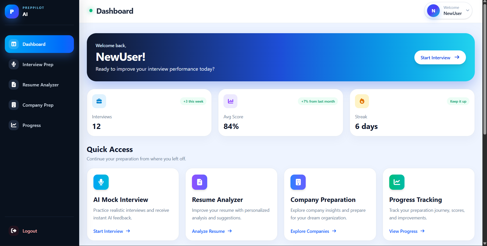
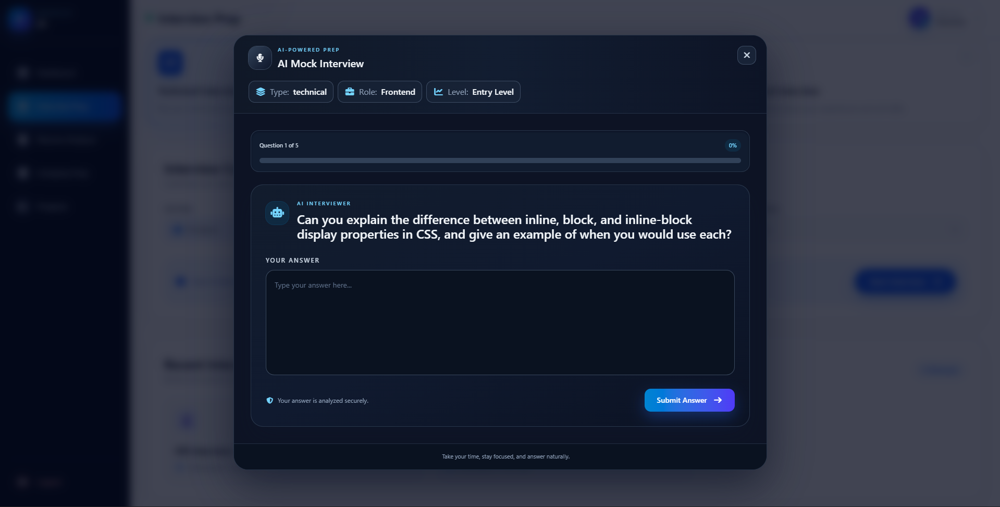
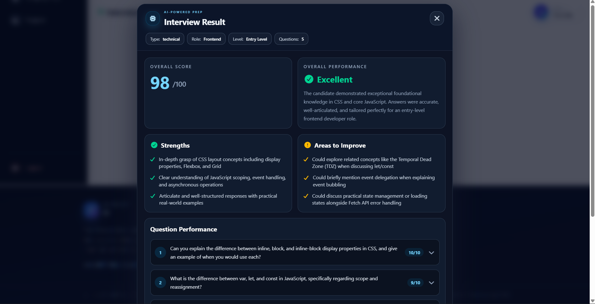
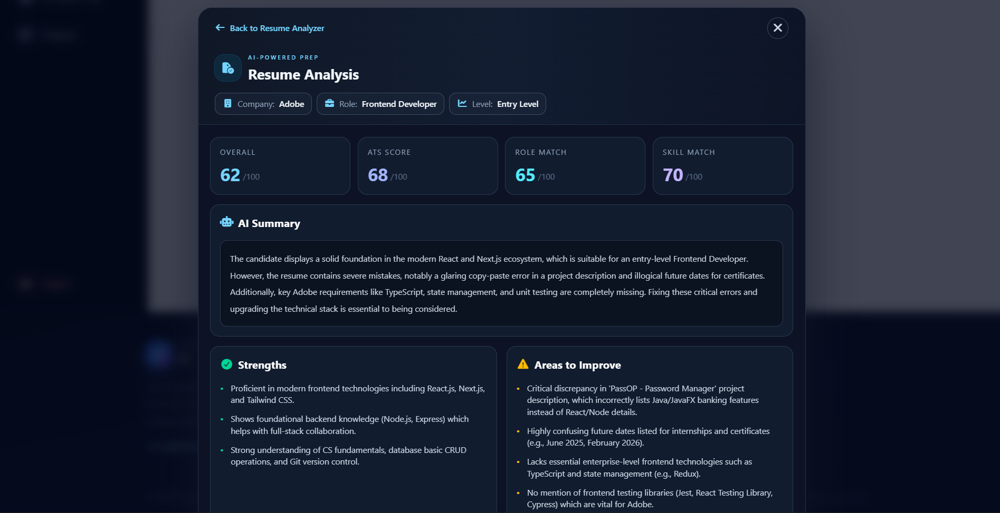
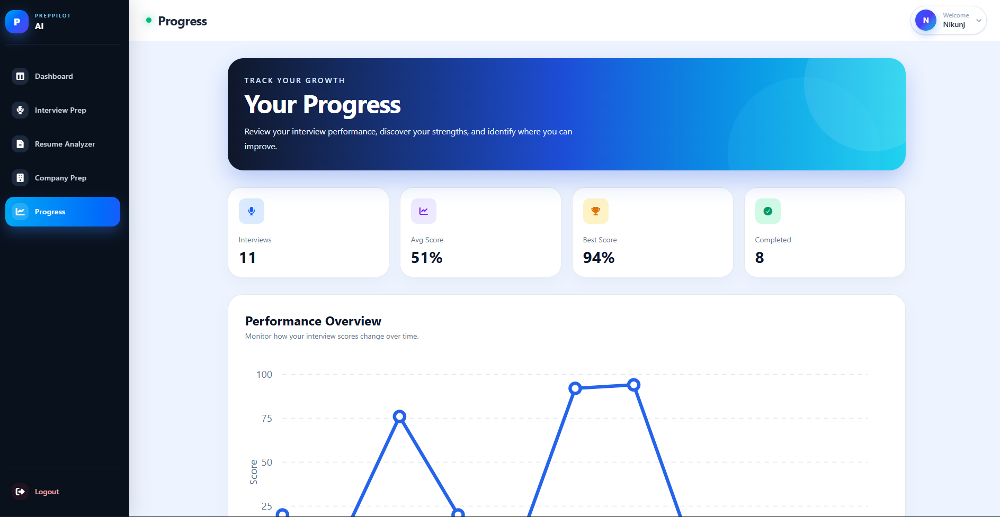
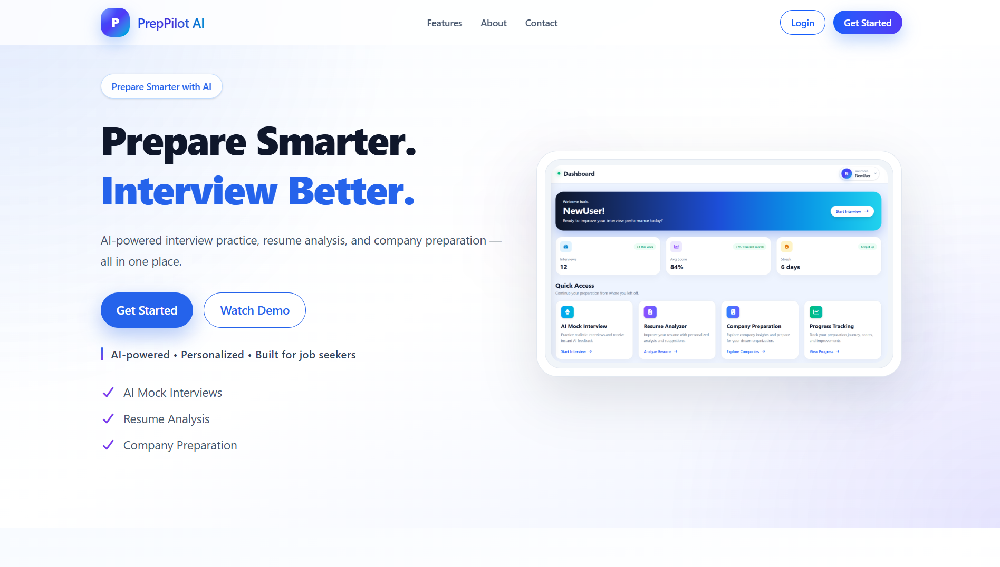

# PrepPilot AI

PrepPilot AI is an AI-powered career preparation platform designed to help students and job seekers prepare for technical interviews, analyze their resumes, and prepare for specific companies and roles.

The platform combines Artificial Intelligence with a modern full-stack web application to provide personalized career preparation in one place.

---

## Overview

Preparing for placements and technical interviews often requires using multiple platforms for interview practice, resume evaluation, company research, and progress tracking.

PrepPilot AI brings these activities together into a single platform.

Users can:

- Practice AI-powered mock interviews
- Receive AI-based interview evaluation
- Analyze their resumes against a target role and company
- Prepare for specific companies
- Track their interview performance
- Manage their profile and account
- Reset or change their password securely

The application uses Google's Gemini API to generate personalized questions, analyze responses, and provide career-related feedback.

---

## Features

### AI Mock Interview

Users can configure an interview based on:

- Interview type
- Job role
- Experience level
- Number of questions

Gemini AI dynamically generates interview questions.

The user answers the questions one by one, after which the system evaluates the responses and provides:

- Overall score
- Question-wise scores
- Feedback
- Strengths
- Areas for improvement
- Overall evaluation

---

### Resume Analyzer

Users can upload their resume in PDF format and select:

- Target company
- Target role
- Experience level

The AI analyzes the resume and provides:

- Overall Resume Score
- ATS Score
- Role Match Score
- Skill Match Score
- Present Skills
- Missing Skills
- Strengths
- Weaknesses
- Improvement Suggestions
- AI-generated Summary

The analyzed resumes are also stored so users can revisit their previous results.

---

### Company Preparation

Users can select a company, role, and experience level to receive an AI-generated preparation plan.

The module provides:

- Company Overview
- Important Skills
- Technical Topics
- Interview Topics
- HR Preparation
- 4-Week Preparation Roadmap
- AI-powered Preparation Tips

---

### Dashboard

The dashboard provides a centralized view of the user's preparation activities.

It includes:

- Recent Interviews
- Recent Resume Analysis
- Company Preparation History
- Interview Scores
- Interview Status
- Quick access to completed activities

---

### Progress Tracking

The Progress section helps users understand their interview performance over time.

It provides:

- Average interview score
- Interview performance history
- Score trends
- Completed interview records
- Performance insights

---

### User Profile

Users can manage their profile information, including:

- Name
- Email
- Phone Number
- Target Role
- Experience Level
- Preferred Company
- Skills

---

### Authentication & Security

PrepPilot AI includes authentication and account security features such as:

- User Registration
- Login
- JWT Authentication
- Protected Routes
- Password Hashing using bcrypt
- Change Password
- Forgot Password
- Secure Password Reset
- Password Reset Token Expiration

Password reset tokens are securely hashed before being stored and expire after a limited period.

---

## Screenshots

### Landing Page

Add your landing page screenshot here.

### Dashboard



### AI Mock Interview



### Interview Evaluation



### Resume Analyzer



### Company Preparation



---

## Tech Stack

### Frontend
- React.js
- JavaScript
- Tailwind CSS
- React Router
- React Toastify
- Vite

### Backend
- MongoDB
- Mongoose
- MongoDB Atlas

### Artificial Intelligence
- Google Gemini API

### Resume Processing
- PDF Processing
- Resume Text Extraction
- AI-based Resume Analysis

### Email
- Resend
- Password Reset Emails

### Deployment & Tools
- Git
- GitHub
- Vercel
- Render
- Vercel Analytics

## System Architecture

```text
User
  ↓
React.js Frontend
  ↓
Node.js + Express.js Backend
  ↓
 ┌───────────────┬────────────────┬───────────────┐
 ↓               ↓                ↓
MongoDB       Gemini API        Resend
Atlas         AI Services       Email Service
```

## How It Works

### AI Mock Interview

Configure Interview  
↓  
Generate AI Questions  
↓  
Answer Questions  
↓  
AI Evaluation  
↓  
Score & Feedback

### Resume Analyzer

Upload Resume  
↓  
Extract Resume Text  
↓  
Select Company & Role  
↓  
AI Resume Analysis  
↓  
Scores & Recommendations

### Company Preparation

Select Company & Role  
↓  
AI Analysis  
↓  
Skills & Technical Topics  
↓  
HR Preparation  
↓  
4-Week Preparation Roadmap

## Installation

### Prerequisites

Make sure you have the following installed:

- Node.js
- npm
- Git
- MongoDB Atlas account
- Gemini API key
- Resend API key

### Clone the Repository

```bash
git clone [<your-repository-url>](https://github.com/Nikunj0Verma/PrepPilotAI)
cd PrepPilotAI
```

## Environment Variables

### Backend

Create a `.env` file inside the `backend` directory:

```env
PORT=5000
MONGO_URI=your_mongodb_connection_string
JWT_SECRET=your_jwt_secret
GEMINI_API_KEY=your_gemini_api_key
RESEND_API_KEY=your_resend_api_key
FRONTEND_URL=http://localhost:5173
```

### Frontend

Create a `.env` file inside the `frontend` directory:

```env
VITE_API_URL=http://localhost:5000/api
```

## Deployment

PrepPilot AI is deployed using a separate frontend and backend architecture.

- **Frontend:** Vercel
- **Backend:** Render
- **Database:** MongoDB Atlas
- **AI Services:** Google Gemini API
- **Email Service:** Resend
- **Analytics:** Vercel Analytics

### Production URLs

- **Frontend:** https://prep-pilot-ai0.vercel.app
- **Backend:** https://preppilotai-pd9u.onrender.com

The frontend communicates with the deployed backend through REST APIs, while MongoDB Atlas handles persistent data storage.


## Future Scope

- AI-powered coding interviews
- Real-time coding evaluation
- Job Description analysis
- Resume optimization based on Job Descriptions
- Personalized learning paths
- Voice-based AI interviews
- Adaptive interview difficulty
- Advanced performance analytics
- Personalized preparation recommendations

## Author

**Nikunj Verma**

B.Tech – Computer Science & Engineering

Interested in:
- Software Development
- Full-Stack Development
- Artificial Intelligence
- Data Structures & Algorithms

### Connect with Me

- LinkedIn: ## Author

**Nikunj Verma**

B.Tech – Computer Science & Engineering

Interested in:
- Software Development
- Full-Stack Development
- Artificial Intelligence
- Data Structures & Algorithms

### Connect with Me

- LinkedIn: ## Author

**Nikunj Verma**

B.Tech – Computer Science & Engineering

Interested in:
- Software Development
- Full-Stack Development
- Artificial Intelligence
- Data Structures & Algorithms

### Connect with Me

- LinkedIn: [<your-linkedin-profile>](https://www.linkedin.com/in/nikunjverma000/)
- GitHub: [<your-github-profile>](https://github.com/Nikunj0Verma)
- GitHub: <your-github-profile>
- GitHub: <your-github-profile>

```text

